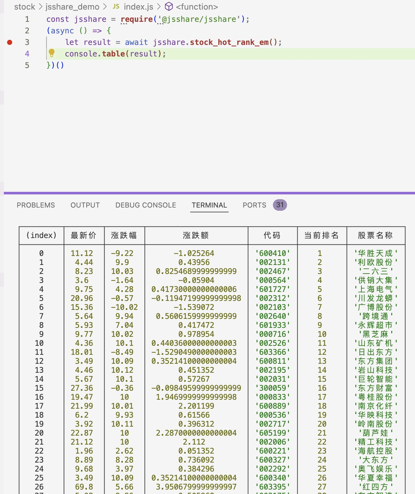
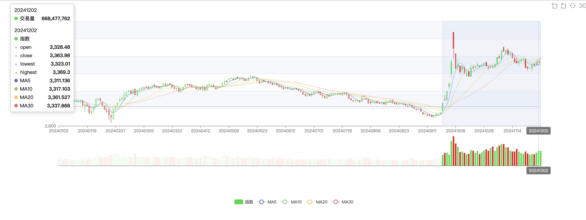
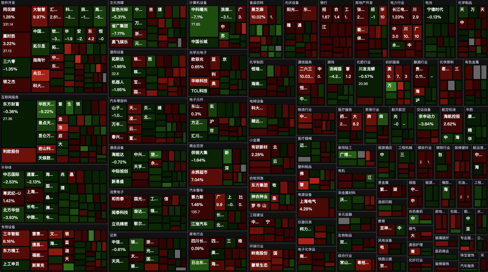
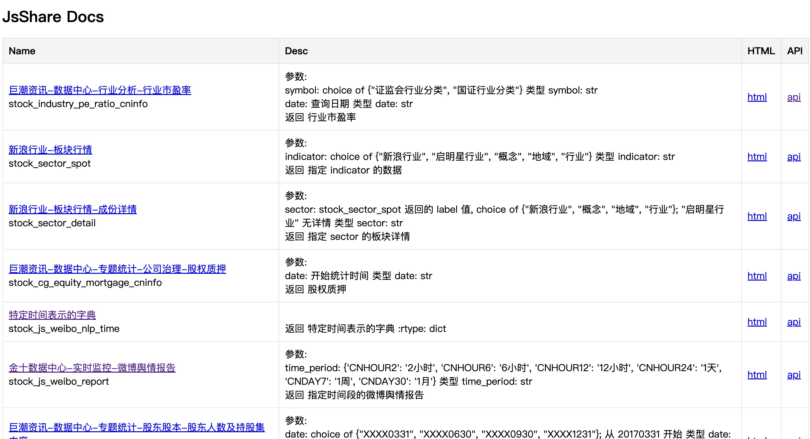

# JsShare


## 介绍
首先要特别感谢 FuShare 和 TuShare 在代码和项目开发上对本项目提供的借鉴和学习的机会!

JsShare 是基于 NodeJs 的财经数据接口库，目的是实现对股票等金融产品的基本面数据、实时和历史行情数据、衍生数据从数据采集、数据清洗到数据落地的一套工具，主要用于学术研究目的。

JsShare 的特点是获取的是相对权威的财经数据网站公布的原始数据，通过利用原始数据进行各数据源之间的交叉验证，进而再加工，从而得出科学的结论。

## 安装教程
```bash
npm i @jsshare/jsshare
```

```javascript
const jsshare = require('@jsshare/jsshare');

(async () => {
    let result = await jsshare.stock_hot_rank_em();
    console.table(result);
})()
```


## 使用说明
```bash 
git clone https://github.com/yuancloud/jsshare.git 
```
```bash
cd jsshare
```
```bash
npm install --registry https://registry.npmmirror.com
```
```bash
npm run dev
```
### 示例-Kline
```url
http://localhost:3000/public/kline.html
```



### 示例-大盘云图
```url
http://localhost:3000/public/treemap.html
```



#### 示例-全部接口
```url
http://localhost:3000/doc.html
```


#### 联系方式

